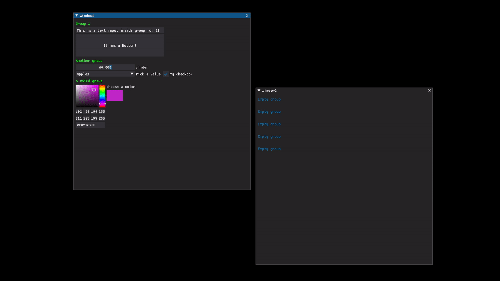
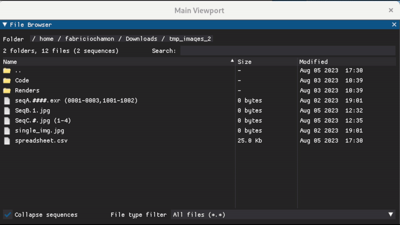
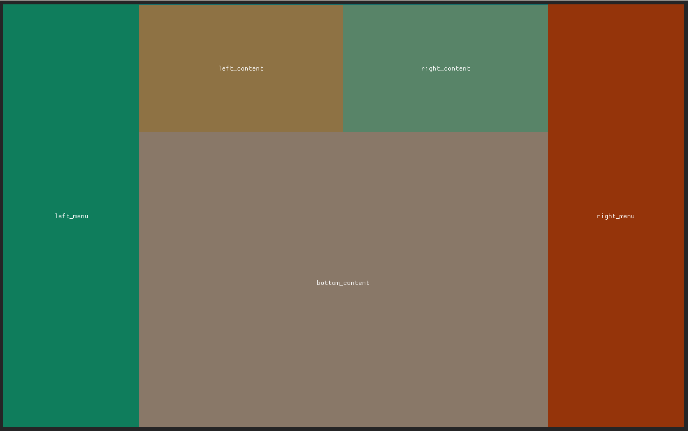
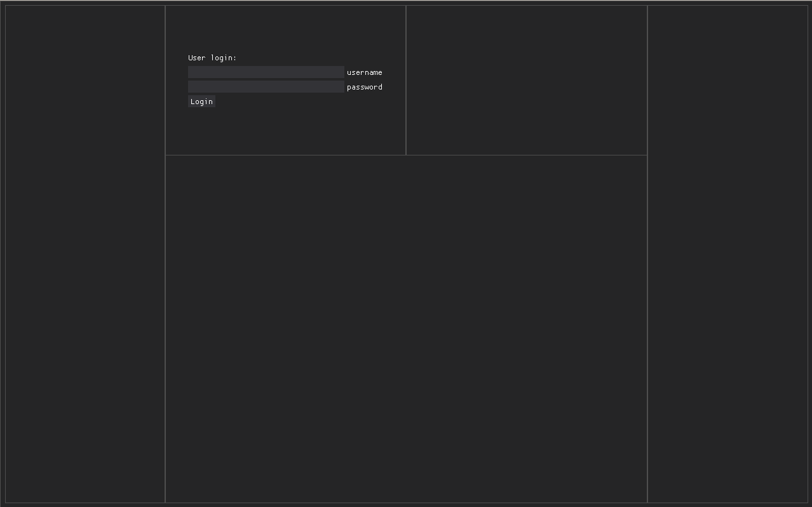

# DearPyGui_Extend
Extensions and custom widgets for [Dear Py GUI](http://github.com/hoffstadt/DearPyGui)

Installation: `pip install dearpygui-extend`

API Documentation: [](https://dearpygui-extend.readthedocs.io/en/latest/?badge=latest) 

**Also check "examples" folder.

</br>

## Movable Groups
Add Drag'n'drop ability to groups ("swap" or "replace" behaviors):



Usage:
```py
import dearpygui.dearpygui as dpg
import dearpygui_extend as dpge

with dpge.movable_group():
	dpg.add_text('Some text')
	...
```

</br>

## File browser
A custom filebrowser with extended functionality.

Features:

* Supports **file sequence** entries:
	`image.001.jpg, image.002.jpg, image.003.jpg --> 'image.###.jpg (001-003)'`
* Multi-selection (pick single or multiple files/sequences)
* Breadcrumb path with navigation icons & folder quick access
* Filetype filters
* Sorting (smart sorting for collapsed sequences)
* Draggable items (ability to expand file sequences on a drop callback)

> [!NOTE]
> Requires [Fileseq](https://pypi.org/project/Fileseq/) package: `pip install fileseq`



Usage:
```py
import dearpygui.dearpygui as dpg
import dearpygui_extend as dpge

dpge.add_file_browser(
	initial_path='~/Downloads/images', 
	collapse_sequences=True, 
	sequence_padding='#'
)
```
</br>

## Layout
A simple, responsive, text-based layouting system that abstracts table creation process away from the user. 

Example:
```
LAYOUT example center center
  COL left_menu 0.2
  COL
    ROW 0.3
      COL left_content
      COL right_content
    ROW
      COL bottom_content
  COL right_menu 0.2
```
will produce this layout:


Usage:
```py
import dearpygui.dearpygui as dpg
import dearpygui_extend as dpge

# use "tab" for identation
layout='''
LAYOUT example center center
	COL left_menu 0.2
	COL
		ROW 0.3
			COL left_content
			COL right_content
		ROW
			COL bottom_content
	COL right_menu 0.2
'''
# create layout
with dpg.window():
	dpge.add_layout(layout, border=True)

# accessing layout panes
with dpg.group(parent='left_content'):

	#add widgets
	dpg.add_text('User login:')
	dpg.add_input_text(label='username')
	dpg.add_input_text(label='password')
	dpg.add_button(label='Login')
	
```
